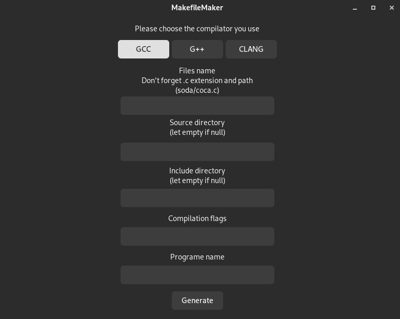

# MakefileMaker
-------------

# What is Makefile Maker

Makefile Maker is a GUI for making makefiles, it allows you to choose the executable name, sources files, source directory, header directory ...

The project is based on the marvelous works of clemedon, [Makefile tutor](https://github.com/clemedon/Makefile_tutor).

# How it works ?

You just need to put your data in the entry, and it will generate a Makefile that you can custom if you need.

# Compilation & installation:  

To install & use this project you will need to have GTK3.0 on your computer
    git clone https://github.com/Oxbian/MakefileMaker.git
    cd MakefileMaker && make

To install gtk:  
__Arch & dérivés__:
    
    sudo pacman -S gtk3
__Ubuntu & Debian:__
    
    sudo apt-get install libgtk-3-0

# Contributing

Everyone is free to contribute and help me to improve / update this project. 
Just fork the project, do what you want and make pull request, I will review it with pleasure :)

## License:  
This project is under the GNU GPL v3.0 license, check `LICENSE.md` for more information.

